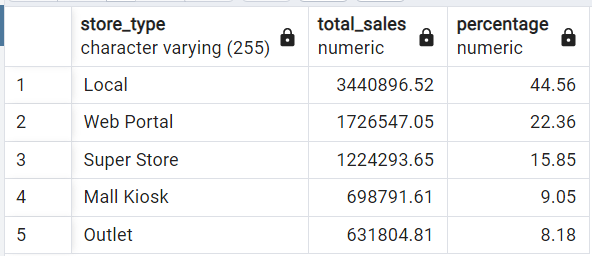

# Multinational Retail Data Centralisation

This is a project from AiCore based on the scenario that I am working for a multinational company that sells various goods across the globe and thus the sales data is spread in various data sources. The main aim of this project is to get sales data accessible to one centralised location or database so that the data is easily accessible or analysable by current members of the team. And hence query the database to get up-to-date metrics for the business.

In this project we are using pgAdmin4 to store the data in the database `sales_data` and postgreSQL for querying. This database will store all the company information once you extract it for the various data sources.

>## **ETL Process**
The data is fetched from various sources. This data is cleaned and then stored into the database for analysis
The are 3 python scripts used for this purpose namely 
- `data_extraction.py`: In this script we create a `DataExtractor` class. This class will work as a utility class, in it you will be creating methods that help extract data from different data sources. The methods contained will be fit to extract data from a particular data source, these sources will include CSV files, an API and an S3 bucket.
- `data_cleaning.py`: In this script we create a `DataCleaning` class with methods to clean data from each of the data sources.
- `database_utils.py` In this script we create a `DatabaseConnector` class which we will use to connect with and upload data to the database.

>### Data Extraction
1. **User details from Amazon RDS**
- The historical data of users is currently stored in an AWS database in the cloud. 
- `DatabaseConnector` class in `database_utils.py` script is used to connect to the Amazon RDS database and in the `DataExtractor` class in `data_extraction.py`, creating a method to extract the user details table and save it as a pandas Dataframe.
2. **User card details from AWS S3**
- The user's card details are stored in a PDF document in an AWS S3 bucket.
- Installing the Python package tabula-py will help to extract data from a pdf document.
- Creating a method in the `DataExtractor` class, which takes in a link as an argument and returns a pandas DataFrame.
3. **Store data through the use of an API**
- The API has two GET methods. One will return the number of stores in the business and the other to retrieve a store given a store number.
- To connect to the API we need to include the API key to connect to the API in the method header.
- By Creating a dictionary to store the header details it will have a key x-api-key with the value.
- The two endpoints for the API are for:
    - Retrieving a store
    - Returning the number of stores
- Creating a method in the `DataExtractor` that returns the number of stores to extract. It should take in the number of stores endpoint and header dictionary as an argument. This tells us how many stores need to be extracted from the API.
- Creating another method which will take the retrieve a store endpoint as an argument and extracts all the stores from the API saving them in a pandas DataFrame.
4. **Product details from AWS S3**
- The information for each product the company currently sells is stored in CSV format in an S3 bucket on AWS
- Creating method in DataExtractor which uses the boto3 package to download and extract the information returning a pandas DataFrame.
- The S3 address for the products data is the following s3://data-handling-public/products.csv the method will take this address in as an argument and return the pandas DataFrame.
5. **Order details from Amazon RDS**
- This table which acts as the single source of truth for all orders the company has made in the past is stored in a database on AWS RDS.
- Creating a method to extract the orders data table and save it as a pandas Dataframe. 

>### Data Cleaning
On each dataframe following checks and corrections are done in order to clean the data
- Checking for duplicates
- Replacing correct values where the column have incorrectly typed values
- Checking for any errors with date
- Converting the column to correct data types  
- Removing rows filled with any erroneous values and NULL values
- Removing columns that does not have any meaningful data
    

>### Data Loading
- Once the data is cleaned, all these dataframes are stored in the `sales_data` database as tables in pgAdmin 4. We use SQL to query these tables 
    - User details table: `dim_users`
    - User card details table:`dim_card_details`
    - Store details table: `dim_store_details`
    - Product details table: `dim_products`
    - Order details table: `orders_table`
- Each table will serve the `orders_table` which will be the single source of truth for the orders.
- With the primary keys created in the tables prefixed with `dim` we will create
 the foreign keys in the orders_table to reference the primary keys in the other tables.
- Using SQL we create foreign key constraints that reference the primary keys of the other table. This makes the star-based database schema complete.

    

>## **Data Analysis**
In this project, the data analysed using PostgreSQL.These are the following analysis performed

1. *How many stores does the business have and in which countries?*

    

2. *Which locations currently have the most stores?*

    

3. *Which month product the average highest cost of sales typically?*

    

4. *How many sales are coming from online?*

    

5. *What percentage of sales come through each type of store?*

    

6. *Which month in each year produced the highest cost of sales?*

    

7. *What is our staff headcount?*

    

8. *Which German store type is selling the most?*

    

This is a performace report created using Power BI

